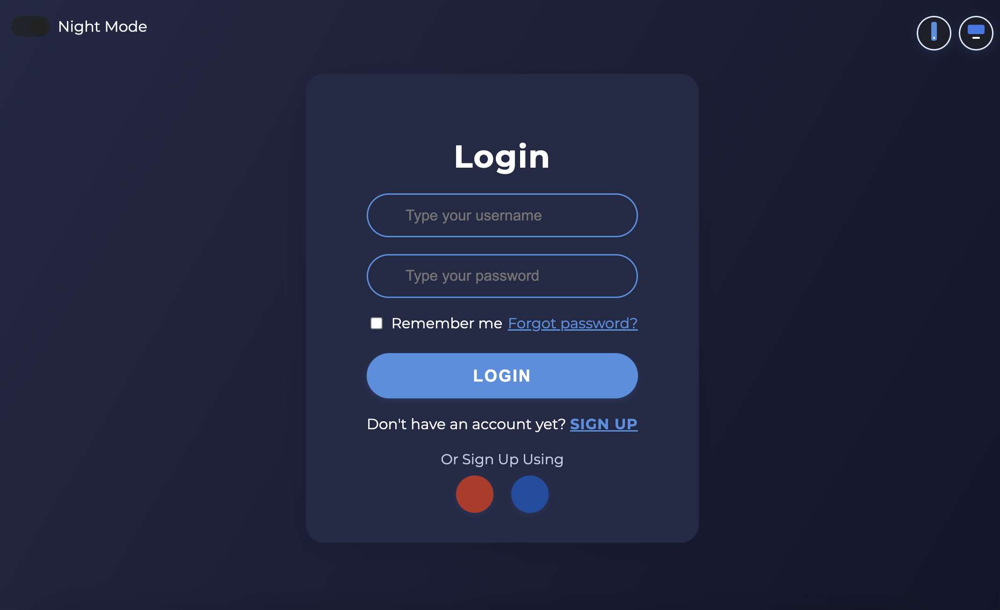

# Login Page

A modern, responsive and professional login page built with HTML, CSS and JavaScript.

## Vista previa

A continuación se muestran capturas de la interfaz en modo claro, modo noche, recuperación de contraseña y registro:





## Features

- **Responsive Design:** Adapts to both desktop and mobile views, with toggle controls for preview.
- **Night Mode:** Switch between light and dark themes with a sliding button.
- **User Experience:**
  - Centered login form with avatar and clear title.
  - Username and password fields with icons and show/hide password toggle.
  - "Remember me" checkbox and "Forgot password?" link.
  - Professional feedback modals for login, password reset, and sign up.
  - Social login buttons for Google and Facebook.
- **Visuals:**
  - Clean, modern font and color palette.
  - Subtle hover effects and clear visual hierarchy.
  - Modal dialogs with background blur for feedback and forms.

## Usage

1. Clone or download this repository.
2. Open `login.html` in your browser.
3. Use the top-left switch for night mode and the top-right buttons to preview mobile/desktop views.
4. Try the login, forgot password, and sign up flows to see professional feedback modals.

## Structure

```
Login/
├── login.html      # Main HTML file
├── login.css       # Stylesheet
└── README.md       # This file
```

## Customization

- Edit `login.html` and `login.css` to adjust colors, texts, or add new features.
- All modal dialogs and feedback messages are in English for professional presentation.

## Preview


---

**Created for modern web projects. Ready to use and easy to adapt for your needs.**
